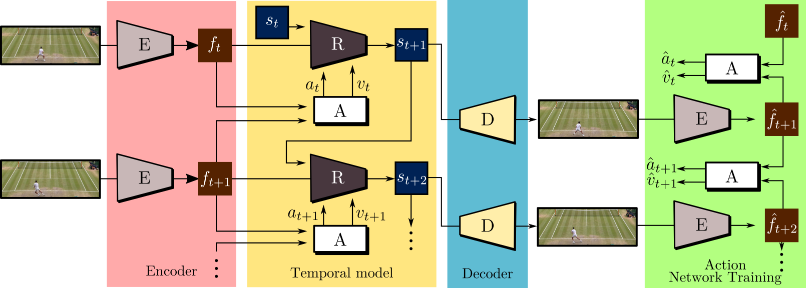

# Playable Video Generation
 

    </em>
      

 

> **Playable Video Generation** 
> [Willi Menapace](https://www.willimenapace.com/), [Stéphane Lathuilière](https://stelat.eu/), [Sergey Tulyakov](http://www.stulyakov.com/), [Aliaksandr Siarohin](https://github.com/AliaksandrSiarohin), [Elisa Ricci](http://elisaricci.eu/) 
> **CVPR 2021 (Oral)**

> Paper: [ArXiv](https://arxiv.org/abs/2101.12195) 
> Supplementary: [Website](https://willi-menapace.github.io/playable-video-generation-website/) 
> Demo: [Try it Live](https://willi-menapace.github.io/playable-video-generation-website/play.html) 

> **Abstract:** *This paper introduces the unsupervised learning problem of playable video generation (PVG). In PVG, we aim at allowing a user to control the generated video by selecting a discrete action at every time step as when playing a video game. The difficulty of the task lies both in learning semantically consistent actions and in generating realistic videos conditioned on the user input. We propose a novel framework for PVG that is trained in a self-supervised manner on a large dataset of unlabelled videos. We employ an encoder-decoder architecture where the predicted action labels act as bottleneck. The network is constrained to learn a rich action space using, as main driving loss, a reconstruction loss on the generated video. We demonstrate the effectiveness of the proposed approach on several datasets with wide environment variety.*

# Overview

 

      
    <em>
    Figure 1. Illustration of the proposed CADDY model for playable video generation.
    </em>

 

Given a set of completely unlabeled videos, we jointly learn a set of discrete actions and a video generation model conditioned on the learned actions. At test time, the user can control the generated video on-the-fly providing action labels as if he or she was playing a videogame. We name our method CADDY. Our architecture for unsupervised playable video generation is composed by several components. An encoder E extracts frame representations from the input sequence. A temporal model estimates the successive states using a recurrent dynamics network R and an action network A which predicts the action label corresponding to the current action performed in the input sequence. Finally, a decoder D reconstructs the input frames. The model is trained using reconstruction as the main driving loss.

# Requirements

  We recommend the use of Linux and of one or more CUDA compatible GPUs. We provide both a Conda environment and a Dockerfile to configure the required libraries.

## Conda

The environment can be installed and activated with:

`conda env create -f env.yml`

`conda activate video-generation`

## Docker

Use the Dockerfile to build the docker image:

`docker build -t video-generation:1.0 .`

Run the docker image mounting the root directory to `/video-generation` in the docker container:

`docker run -it --gpus all --ipc=host -v /path/to/directory/video-generation:/video-generation video-generation:1.0 /bin/bash`

# Preparing Datasets

## BAIR

Download the `bair_256_ours.tar.gz` archive from [Google Drive](https://drive.google.com/drive/folders/1CuHK_-cFWih0F8AxB4b76FoBQ9RjWMww?usp=sharing)  and extract it under the `data` folder.

We thank [Frederik Ebert](https://febert.github.io/) and the Berkeley Artificial Intelligence Research Lab for providing us with the high resolution version of their [BAIR robot-pushing dataset](https://sites.google.com/berkeley.edu/robotic-interaction-datasets).

## Atari Breakout

Download the `breakout_v2_160_ours.tar.gz` archive from [Google Drive](https://drive.google.com/drive/folders/1CuHK_-cFWih0F8AxB4b76FoBQ9RjWMww?usp=sharing)  and extract it under the `data` folder.

## Tennis

The Tennis dataset is automatically acquired from Youtube by running

`./get_tennis_dataset.sh`

This requires an installation of `youtube-dl` ([Download](https://github.com/ytdl-org/youtube-dl)).
Please run `youtube-dl -U` to update the utility to the latest version.
The dataset will be created at `data/tennis_v4_256_ours`.

## Custom Datasets

Custom datasets can be created from a user-provided folder containing plain videos. Acquired video frames are sampled at the specified resolution and framerate. `ffmpeg` is used for the extraction and supports multiple input formats. By default only mp4 files are acquired.

`python -m dataset.acquisition.convert_video_directory --video_directory <input_directory> --output_directory <output_directory> --target_size <width> <height> [--fps <fps> --video_extension <extension_of_videos> --processes <number_of_parallel_processes>]`

As an example the following command transforms all mp4 videos in the `tmp/my_videos` directory into a 256x256px dataset sampled at 10fps and saves it in the `data/my_videos` folder
`python -m dataset.acquisition.convert_video_directory --video_directory tmp/my_videos --output_directory data/my_videos --target_size 256 256 --fps 10`

# Using Pretrained Models

Pretrained models in `.pth.tar` format are available for all the datasets and can be downloaded at the following link:
[Google Drive](https://drive.google.com/drive/folders/1xLlJ8Xh6_wOEEARwBcoeVng2Bbi-wAah?usp=sharing)

Please place each directory under the `checkpoints` folder. Training and inference scripts automatically make use of the `latest.pth.tar` checkpoint when present in the `checkpoints` subfolder corresponding to the configuration in use.

# Playing

When a `latest.pth.tar` checkpoint is present under the `checkpoints` folder corresponding to the current configuration, the model can be interactively used to generate videos with the following commands:

- Bair:
`python play.py --config configs/01_bair.yaml`

- Breakout:
`python play.py configs/breakout/02_breakout.yaml`

- Tennis:
`python play.py --config configs/03_tennis.yaml`

A full screen window will appear and actions can be provided using number keys in the range [1, `actions_count`]. Number key 0 resets the generation process.

The inference process is lightweight and can be executed even in browser as in our [Live Demo](https://willi-menapace.github.io/playable-video-generation-website/play.html).

# Training

The models can be trained with the following commands:

`python train.py --config configs/<config_file>`

The training process generates multiple files under the `results` and `checkpoint` directories a sub directory with the name corresponding to the one specified in the configuration file. In particular, the folder under the `results` directory will contain an `images` folder showing qualitative results obtained during training. The `checkpoints` subfolder will contain regularly saved checkpoints and the `latest.pth.tar` checkpoint representing the latest model parameters.

The training can be completely monitored through Weights and Biases by running before execution of the training command:
`wandb init`

Training the model in full resolution on our datasets required the following GPU resources:
 - BAIR:  4x2080Ti 44GB
 - Breakout: 1x2080Ti 11GB
 - Tennis: 2x2080 16GB

Lower resolution versions of the model can be trained with a single 8GB GPU.

# Evaluation

Evaluation requires two steps. First, an evaluation dataset must be built. Second, evaluation is carried out on the evaluation dataset. To build the evaluation dataset please issue:

`python build_evaluation_dataset.py --config configs/<config_file>`

The command creates a reconstruction of the test portion of the dataset under the `results/<run_name>/evaluation_dataset` directory.
To run evaluation issue:

`python evaluate_dataset.py --config configs/evaluation/configs/<config_file>`

Evaluation results are saved under the `evaluation_results` directory the folder specified in the configuration file with the name `data.yml`.
